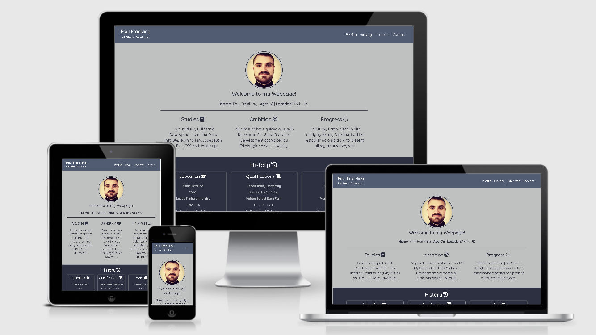
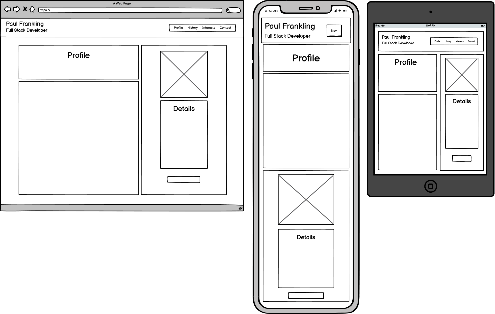
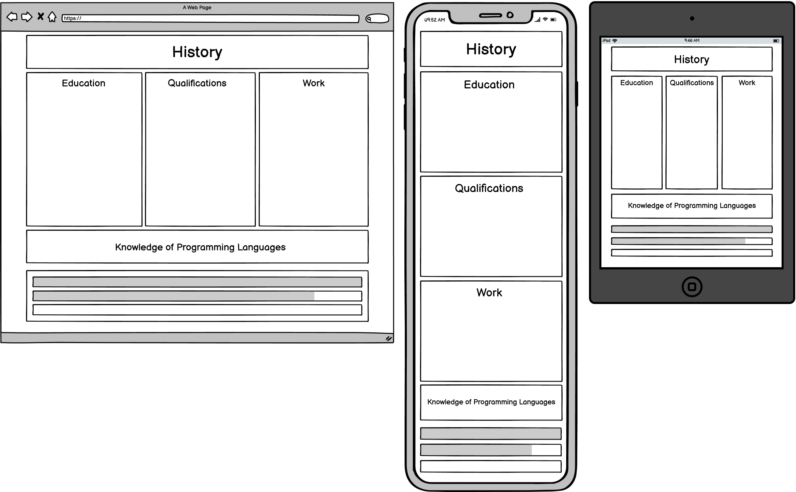
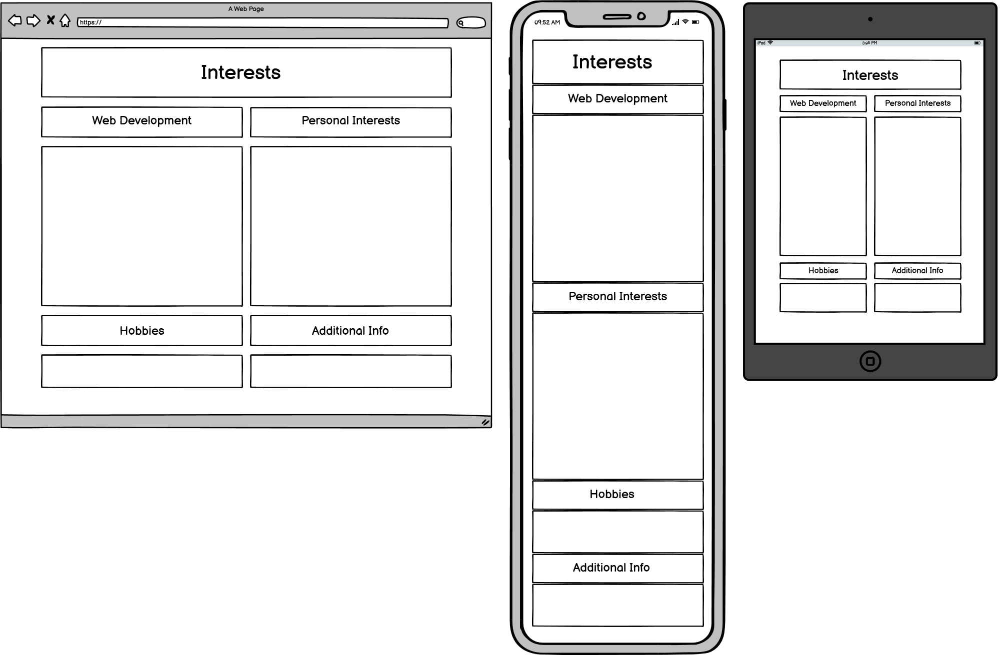
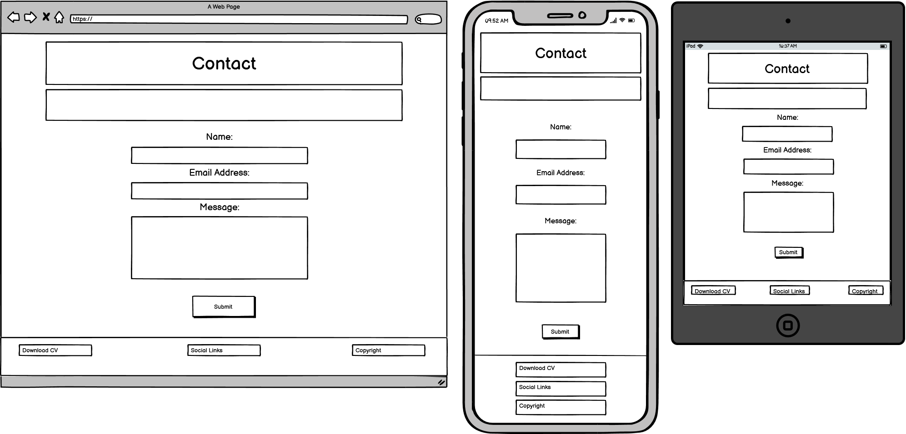
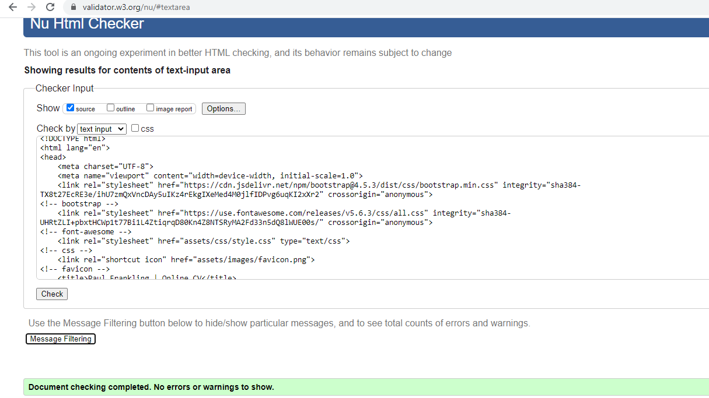
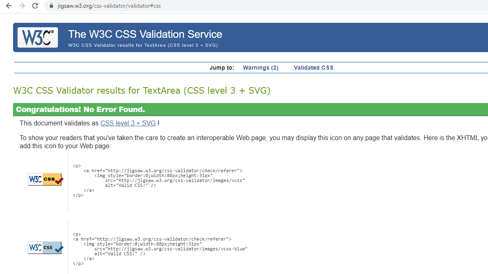
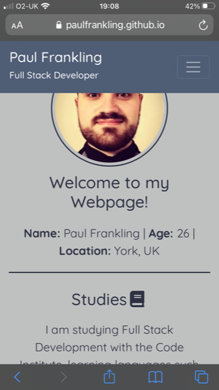

# Paul Frankling | Online CV

## Code Institute - Milestone Project 1

[Click here to view my website](https://paulfrankling.github.io/PaulFrankling-online-cv/)

This website has been designed to represent a professional overview of myself to a target audience of prospective employers, recruiters or web developers. The primary goal of the website is to make a memorable impression on this target audience and for them to communicate with me using the contact page.

This website may also interest anyone looking to create a CV or Online CV and look for ideas. Friends and Family may also like to view my project.

## UX:

  * ### User Stories

    * #### First Time Visitor Goals
      * As a First Time Visitor, I want the user to understand the purpose of the webpage and learn about me through my Online CV.
      * As a First Time Visitor, I want to navigate easily around the website to find content.
      * As a First Time Visitor, I want to locate social media links to further legitamise the profile and allow the employer to see myself in a different capacity.

    * #### Returning Visitor Goals
      * As a Returning Visitor, I would like to contact the person with any queries or propositions.
      * As a Returning Visitor, I would like to be able to view and/or download the persons CV that is available on the website.

    * #### Frequent User Goals
      * As a Frequent User, I would like to be able to connect with the person on their social media accounts.
      * As a Frequent User, I would like to see of any updates to their CV or website.

## Design:

### Colour Scheme

The colour scheme of the webpage is:
* Space Cadet `#2d3142`
* Independence `#4f5d75`
* Silver `#bfc0c0`
* Mandarin `#ef8354`
* White `#fff`

### Typography

The website uses the font of *Quicksand* and the font of *Open-sans* is used as backup font in case of any difficulty to present the primary font of *Quicksand*.

### Imagery

In the **Profile section**, I have used a professionally presented image to suit the purpose of the website, which is providing a good impression to an employer or potential colleague.

### Wireframes

* **Profile section** (Including Header) wireframe - 
* **History section** wireframe - 
* **Interests section** wireframe - 
* **Contact section** (Including Footer) wireframe - 

## Features:

The website has a responsive fixed-top navigation bar in the header and I have added `scroll-behavior: smooth;` to the navigation to keep the user oriented by scrolling to its destination. It looks better than the navigation instantly taking the user to its website destination.
The fixed-top feature provides a more useful aspect to the navigation bar as the user doesn't need to scroll to the top to use it.
The links in the navigation bar also features a change of colour to madarin `#ef8354` when the user hovers over each link which has been done to enhance interactivity.

The Footer has copyright information as well as social media icons and a download icon for my CV. Again, I have implemented a change of colour to mandarin `#ef8354` when these icons are hovered over.

This website is fully responsive.

### Profile Section

My profile section is split into two parts; The first part is my image and personal details and the second part is a short summary of myself. The second part splits into three columns when viewed on a tablet and desktop. 

My image is used to present a perception of professionalism to the user. My section below explains my present status, my future aims and future plans.

### History Section

In this section, I present three boxes; my education timeline, qualifications and work timeline. When viewed on a tablet or desktop, these boxes are split into three columns.

Next, I have implemented three progress bars indicating my knowledge of programing languages; HTML, CSS and Javascript.

### Interests Section

In this section, I have included four parts; Web Development, Personal Interests, Hobbies and Additional Info. When viewed on a tablet or desktop, the four parts are split into two columns of two.

### Contact Section

This section includes a Contact Form, which allows the user to input their name, email and a message. The contact form provides a message to the user when something is missing from it with the use of `required`. I have also used jQuery to retain a sensible width to the contact form on wider device screens. The contact page also has a button in which to submit the information.

## Features to implement in the future:

* I want to apply a portfolio section to my website to display future projects, I have stated this in my **Profile Section**;

> "Whilst studying for my Diploma, I will be establishing a portfolio to present all my created projects."

* I want to apply a modal to my contact-form that will give the viewer a submission confirmation message when they have completed and submitted the form.

## Technologies used:

### Programming Languages

* [HTML5](https://en.wikipedia.org/wiki/HTML5) 
* [CSS3](https://en.wikipedia.org/wiki/CSS)

### Framework, Libraries and Programs

1. [Bootstrap 4.5](https://getbootstrap.com) 
   * Bootstrap was used to make the site responsive and help with styling and establishing the layout.
1. [Google Fonts](https://fonts.google.com)
   * I used Google Fonts to import the font *'Quicksand'* to my style.css which was used all throughout the website.
1. [Font Awesome](https://fontawesome.com)
   * Font Awesome was used to add icons to my website to deliver a better UX.
1. [Coolor](https://coolors.co)
   * I used Coolor to provide a colour scheme for the website and for UX purposes.
1. [Hover.css](https://ianlunn.github.io/Hover/)
   * I added Hover.css to my navbar links as well as my social media icons and CV download icon to add colour change when hovered over.
1. [jQuery](https://jquery.com/)
   * jQuery was used to stop the contact form increasing its width fully on a large screen for the UX.
1. [Autoprefixer](https://autoprefixer.github.io/)
   * Autoprefixer was used to help implement a `webkit` to my box-shadow in the **History section** to support the feature on all browsers.
1. [Balsamiq](https://balsamiq.com/wireframes/desktop/)
   * I used Balsamiq to create my wireframes for the project.  
1. [Git](https://git-scm.com/)
   * I used Git for version control. It was through the terminal; Gitpod, that I used to commit and push code to GitHub.
1. [GitHub](https://github.com/)
   * GitHub was used to store projects pushed from Git.

## Testing:

I validated my webpage with the use of the W3C Markup Validator and the W3C CSS Validator to ensure there were no syntax errors.

* [W3C Markup Validator](https://validator.w3.org/#validate_by_input) result - 
* [W3C CSS Validator](https://jigsaw.w3.org/css-validator/#validate_by_uri) result - 

### Testing of User Stories in UX section:

  * First Time Visitor Goals

    * As a First Time Visitor, I want the user to understand the purpose of the webpage and learn about me through my Online CV.

      1. On first view of the website, the user is met with a clear and concise navigation bar which takes them to the page of their choice.
      1. The user is met with three sections of in-depth past, present and future information on me.

    * As a First Time Visitor, I want to navigate easily around the website to find content.

      1. The navigation bar shows clear options in which section to go on the page. I implemented a fixed-top navigation bar which is very helpful for the user moving to another area of the page.

    * As a First Time Visitor, I want to locate social media links to further legitamise the profile and allow the employer to see myself in a different capacity.

      1. At the bottom of the page, the user can view different social media accounts of mine. The links take the user to a new tab, keeping my website open on the previous tab.

  * Returning Visitor Goals
    
      * As a Returning Visitor, I would like to contact the person with any queries or propositions.

        1. There is an established contact form for the user to contact me and the navigation takes the user straight to it.

      * As a Returning Visitor, I would like to be able to view and/or download the persons CV that is available on the website.

        1. The footer of the webpage allows the user to download my CV through the use of an interactive icon.

        1. The pdf file opens on a new tab for the user, maintaining my website on the previous tab.

  * Frequent User Goals
    
      * As a Frequent User, I would like to be able to connect with the person on their social media accounts.

        1. The user can frequently return to the website and contact me more informally through the use of my social media accounts.

      * As a Frequent User, I would like to see of any updates to their CV or website.

        1. The user can return to see of any updates made to some aspects of my CV, such as any new qualifications or new job roles. 

### Further Testing

* I have tested this website on the following browsers:

  * Google Chrome
  * Microsoft Edge
  * Internet Explorer
  * Safari

* I have tested my website on the following:
  
  * iPhone X
  * iPhone 7
  * iPad
  * iPad Mini 
  * Huawei P Smart
  * Huawei P30 Lite
  * Acer Laptop

* I asked Friends and Family to borrow their phone or tablet to view my website in order to test the site. I also asked for feedback and if they were able to point out any bugs or UX issues.

* I tested all internal links and they worked correctly.

* All external links were tested and they opened on a new tab correctly.

* The Contact Form was tested and a message appeared everytime a field wasn't entered or entered correctly.

### Fixed Bugs

* Font-awesome icons weren't appearing on the iPad Mini, I changed `<script src="https://kit.fontawesome.com/f39061b49c.js"` to `<link rel="stylesheet" href="https://use.fontawesome.com/releases/v5.6.3/css/all.css"` and this cured the problem instantly as the icons began to show.

### Known Bugs

* On Apple iPhones and iPads, the smooth scroll doesn't work and the navigation flashes to the link instantly. It also did this on Microsoft Edge and Internet Explorer when I viewed it on laptop and Safari when I viewed it on the iPhone.
(Javascript is needed in order to get this to work as it states [here](https://stackoverflow.com/questions/56011205/is-there-a-safari-equivalent-for-scroll-behavior-smooth/56011281#:~:text=You%20can%20use%20%2Dwebkit%2Doverflow,No%20javascript%20required))

* Also on iPhones and iPads, the link to the **Profile section** sometimes takes the user almost half way down the image at the top of the page. I tested this on my laptop, Huawei P30 Lite and P Smart and the image was always fully visible, which was the desired outcome.
Here is an image of the bug on the iPhone 7: 

* The Contact Form refreshes at the **Contact section** when the Form is submitted on iPads, Huawei P30 Lite and P Smart. But on the iPhone 7 and X, it refreshes back to the top of the page.

## Deployment:

### GitHub Pages

This project was deployed to GitHub Pages taking the following steps:

1. Sign in to GitHub and locate the GitHub Repository.
1. Select "Settings" from the menu near the top.
1. Scroll down until you reach the "GitHub Pages" section.
1. Under "Source" click the dropdown menu called "none" and select "Master Branch".
1. The page then automatically refreshes...
1. The Website is now deployed. Scroll down to GitHub Pages section to retrieve the newly published link.

### Forking the GitHub Repository

1. Sign in to GitHub and locate the GitHub Repository.
1. At the top right hand side of the screen, below the navigation bar, you will find the "Fork" button.
1. By clicking this, you will have a copy of the original repository in your GitHub account.

### How to make a Local Clone

1. Sign in to Github and locate the repository.
1. Above the list of files, to the right, click the "Code" button.
1. In order to clone the repository, you can do so by HTTPS, SSH and GitHub CLI. Select one and copy the URL. 
1. Open Git Bash.
1. Change the current working directory to the location you'd like the cloned directory to be made.
1. Type `git clone` and paste the URL you copied in step 3.
1. Press Enter. Your local clone will be created.

## Credits:

### Code
   * [Bootstrap 4.5](https://getbootstrap.com): Bootstrap was used significantly throughout the project to make it responsive. I used the Grid system as well as inputting a fixed-top navbar, a progress bar and contact form.
   * [Stack Overflow](https://stackoverflow.com/) was used to help me style the navbar text colour and was used in HTML to close the navbar when a link is clicked on mobile.
   * [W3Schools](https://www.w3schools.com/) was used to provide a smooth scroll to the website and to style the contact form and the submit button.
   * [Courses.Code Institute](https://courses.codeinstitute.net/courses/course-v1:codeinstitute+FE+2017_T3/course/) was used to style the progress bars and used the jQuery for the contact form.
   * [Solodev](https://www.solodev.com/blog/web-design/how-to-change-icon-colors-and-background-colors-on-hover.stml) was used to apply a hover for the CV icon and the footer icons.
   * [Gauger](https://gauger.io/fonticon/) was used to design and download my favicon.
   * [Spigot](https://spigotdesign.com/smooth-scroll-offset-anchor-links-with-css/) was used as an alternative to using `scroll-padding-top` for each link, which wasn't working on IOS. 

### Content
   * All content was produced and written by the developer.

### Media used
   * All images, png and pdf files were provided by the developer.

### Acknowledgements
   * My Mentor for his highly constructive help and support.
   * The Code Institute's tutor support for quickly assisting with any problems or queries.
   * The Slack community for being very supportive.